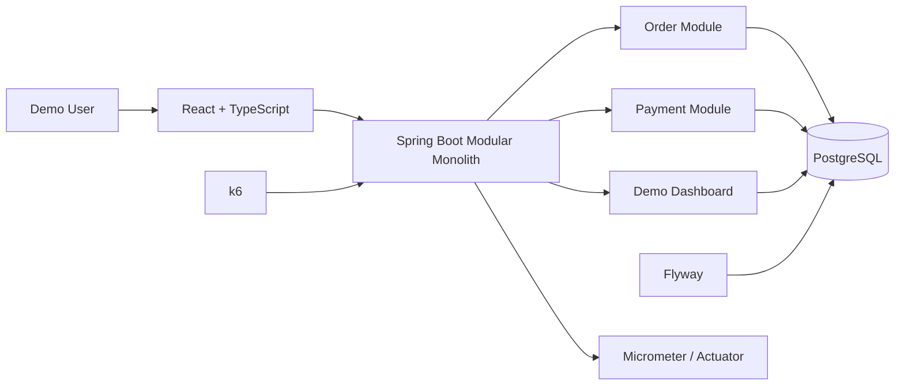
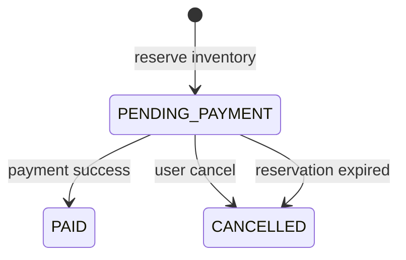

# TicketForge

> For the complete bilingual README, see [README.md](README.md). This file is the standalone English version.

High-concurrency ticketing-system lab for atomic inventory reservation, idempotent ordering, simulated payment and concurrency correctness.

## Quick Links

- [GitHub](https://github.com/Chikachi00/TicketForge)
- [Bilingual README](README.md)
- [中文 README](README.zh-CN.md)
- [Demo Walkthrough](docs/demo-walkthrough.md)
- [System Design](docs/system-design.md)
- [Correctness Report](docs/performance/correctness-ci.md)
- [Architecture Notes](docs/architecture.md)

## Quick Navigation

- [Overview](#overview)
- [Core Features](#core-features)
- [Tech Stack](#tech-stack)
- [Architecture and System Design Highlights](#architecture-and-system-design-highlights)
- [Order and Inventory State Transitions](#order-and-inventory-state-transitions)
- [Concurrency Correctness](#concurrency-correctness)
- [Local Setup](#local-setup)
- [Demo Profile](#demo-profile)
- [Database](#database)
- [Testing and Verification](#testing-and-verification)
- [Project Structure](#project-structure)
- [Known Limitations](#known-limitations)
- [Screenshots--Demo](#screenshots--demo)
- [License](#license)

## Overview

TicketForge is a high-concurrency ticketing-system lab that demonstrates inventory reservation, idempotent ordering, payment callbacks, expiration handling, concurrency races and observability in a ticketing-platform style workflow.

It is not a complete commercial ticketing platform. It is a backend engineering and system design portfolio project. The React UI demonstrates the full transaction path, Spring Boot hosts the business logic, PostgreSQL is the source of truth for inventory, orders and payment state, and k6 validates concurrency correctness. The payment flow is a local simulator only.

TicketForge Portfolio v1 is complete. The project focuses on a runnable, explainable and verifiable core transaction loop.

## Core Features

### Purchase Demo

- Browse events and ticket tiers.
- Select a ticket tier and quantity.
- Create a `PENDING_PAYMENT` order.
- Display order number, amount, status and payment countdown.
- Query current Demo User orders.
- Cancel pending orders manually.

### Inventory Reservation and Oversell Prevention

- PostgreSQL conditional updates provide atomic inventory reservation.
- Stock is deducted only when `available_stock >= quantity`.
- Inventory is tracked as `available`, `reserved` and `sold`.
- Every ticket tier must satisfy:

```text
available + reserved + sold = total
```

The frontend displays server state only; it is not the inventory source of truth.

### Idempotent Ordering

- The user and `Idempotency-Key` pair ensures repeated requests create only one order.
- Network retries or repeated clicks return the same order.
- Inventory is not reserved twice.

### Cancellation and Expiration

- Pending orders can be cancelled manually.
- A scheduled task scans expired orders.
- Cancellation and expiration both perform:

```text
reserved -> available
```

- Order row locks prevent duplicate inventory release.

### Simulated Payment

- Create a local simulated payment session.
- Simulate success or failure.
- Failed payment keeps the order pending and stock reserved.
- Successful payment performs:

```text
reserved -> sold
PENDING_PAYMENT -> PAID
```

- Payment callbacks use HMAC-SHA256.
- Provider events support idempotent replay.
- Payment, cancellation and expiration share a consistent lock order.

### Demo Dashboard

- Backend health.
- Demo profile status.
- Total, available, reserved and sold stock.
- Order status counts.
- Payment status counts.
- Recent 10 orders.
- Per-tier inventory.
- Server-side inventory consistency check.

### Demo Reset

- Resets only `ticketforge-opening-live`.
- Deletes orders and payment records for that event.
- Restores inventory for that event.
- Does not delete users.
- Does not affect the loadtest event.
- Does not reset database sequences.
- Does not modify Flyway history.

### Observability and Load Testing

- Spring Boot Actuator.
- Micrometer Prometheus registry.
- Low-cardinality business metrics.
- k6 smoke, baseline, oversell, idempotency, callback replay and full journey scenarios.
- Manually triggered GitHub Actions Performance workflow.

## Tech Stack

### Backend

- Java 21
- Spring Boot
- Spring Data JPA
- Spring JDBC
- PostgreSQL
- Flyway
- Maven
- Micrometer
- Spring Boot Actuator

### Frontend

- React
- TypeScript
- Vite
- Responsive CSS

### Testing and Tooling

- JUnit 5
- Mockito
- AssertJ
- Maven Surefire / Failsafe
- k6
- GitHub Actions
- PowerShell automation scripts

Redis currently exists only as optional local infrastructure and is not part of the Portfolio v1 transaction path.

## Architecture and System Design Highlights



- TicketForge is a modular monolith, not a microservice system.
- PostgreSQL is the source of truth for inventory, orders and payment state.
- Controllers do not execute SQL directly.
- Transaction logic lives in application services.
- Demo APIs exist only in the `demo` profile.
- load-test APIs exist only in the `loadtest` profile.
- `prod` does not expose Demo Reset.
- Flyway manages schema migrations.

See [docs/system-design.md](docs/system-design.md) for the fuller design.

## Order and Inventory State Transitions

### Reservation

```text
available - quantity
reserved  + quantity
order     -> PENDING_PAYMENT
```

### Payment Success

```text
reserved - quantity
sold     + quantity
order    -> PAID
payment  -> SUCCESS
```

### Cancellation or Expiration

```text
reserved  - quantity
available + quantity
order     -> CANCELLED
```



## Concurrency Correctness

The current confirmed oversell spike result comes from the existing correctness summary:

```text
50 concurrent order attempts
20 available tickets
20 successful reservations
30 expected OUT_OF_STOCK
0 oversell
0 inventory inconsistency
P95 approximately 329.27 ms
```

This is a small concurrency correctness test in GitHub Actions or a local environment. It validates state consistency and is not a real deployment capacity or SLO claim.

See [docs/performance/correctness-ci.md](docs/performance/correctness-ci.md) for the full report.

## Local Setup

The simplest startup path:

```powershell
git clone https://github.com/Chikachi00/TicketForge.git
cd TicketForge
.\scripts\start-demo.ps1
```

The script checks:

- Java 21.
- Node and npm.
- PostgreSQL.
- Ports 8080 / 5173.
- Demo backend startup.
- Vite frontend startup.
- Health check.
- Browser launch for `http://localhost:5173`.

Notes:

- Docker is not required.
- Existing Java or Node processes are not stopped automatically.
- Redis is not started automatically.
- Logs remain in separate PowerShell windows.

Manual backend startup:

```powershell
cd backend
.\mvnw.cmd spring-boot:run "-Dspring-boot.run.profiles=demo"
```

Manual frontend startup:

```powershell
cd frontend
npm install
npm run dev
```

## Demo Profile

```powershell
cd backend
.\mvnw.cmd spring-boot:run "-Dspring-boot.run.profiles=demo"
```

Demo APIs:

```text
GET  /api/demo/profile
GET  /api/demo/dashboard
POST /api/demo/reset
```

Notes:

- Demo management APIs exist only in the `demo` profile.
- Reset requires `X-Demo-Secret`.
- The default secret is for local use only.
- Production management secrets should not be placed in public frontend environment variables.

## Database

Local defaults:

```text
Database: ticketforge
Username: ticketforge
Password: ticketforge_dev
Port: 5432
```

Notes:

- PostgreSQL must be installed and running first.
- Flyway runs V1 through V4 at application startup.
- Do not modify already-applied migrations.
- Docker Compose is optional, not mandatory.

Optional Docker infrastructure:

```powershell
docker compose up -d
```

Docker is optional. TicketForge can run with a locally installed PostgreSQL instance.

## Testing and Verification

### Backend unit tests

```powershell
cd backend
.\mvnw.cmd test
```

### PostgreSQL integration tests

```powershell
.\mvnw.cmd verify -Pintegration
```

### Frontend

```powershell
cd frontend
npm ci
npm run build
```

### k6 static validation

```powershell
cd load-tests
k6 inspect scenarios/smoke.js
k6 inspect scenarios/order-baseline.js
k6 inspect scenarios/oversell-spike.js
k6 inspect scenarios/idempotency-retry.js
k6 inspect scenarios/payment-callback-replay.js
k6 inspect scenarios/full-journey.js
```

### Demo

```powershell
.\scripts\start-demo.ps1
```

## Project Structure

```text
TicketForge/
├─ backend/        Spring Boot backend
├─ frontend/       React + TypeScript demo UI
├─ load-tests/     k6 scenarios and reports
├─ scripts/        PowerShell startup scripts
├─ docs/           system design and demo documentation
├─ compose.yaml    optional local infrastructure
├─ README.md       bilingual main README
├─ README.zh-CN.md Chinese README
└─ README.en.md    English README
```

## Known Limitations

- Demo User only; no formal authentication system.
- Payment is locally simulated.
- No real refunds.
- No real ticket issuing, QR codes or ticket validation.
- No seat selection.
- No virtual queue.
- Redis is not part of the core transaction path.
- No message queue.
- The backend is a modular monolith, not microservices.
- correctness results do not represent real deployment capacity.
- Without a public deployment, the project is local-run only.

These limits define the Portfolio v1 scope rather than claiming a complete commercial ticketing product.

## Screenshots / Demo

Screenshots are pending.

## License

MIT License
