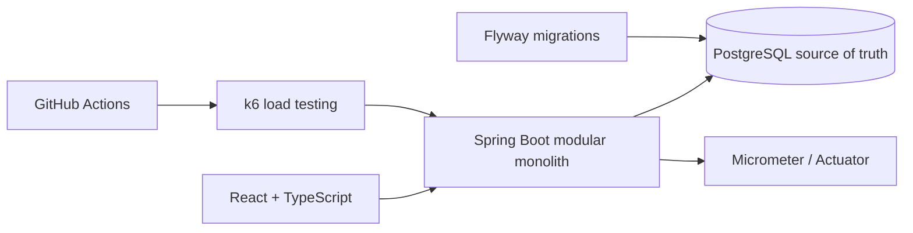

# TicketForge

[中文 README](README.md)

TicketForge is a high-concurrency ticketing-system lab that demonstrates atomic inventory reservation, idempotent ordering, payment callbacks, expiration handling, concurrency correctness and observability.

It is not a real commercial ticketing platform. It is a portfolio project designed to demonstrate the core transaction path in 2 to 3 minutes. PostgreSQL is the source of truth for inventory and orders. The payment flow is a local simulator. k6 data is from CI correctness checks or local single-machine baselines, not a production capacity claim.

## Core Features

- Browse events and ticket tiers.
- Reserve inventory and create `PENDING_PAYMENT` orders as Demo User.
- User-scoped idempotent ordering.
- Cancel and expire pending orders.
- Create local simulated payment sessions.
- Simulate payment success or failure.
- Move inventory from `reserved` to `sold` after successful payment.
- Demo Dashboard for inventory, orders, payments and recent orders.
- Safe demo reset for the demo event only.
- k6 checks for concurrency correctness, oversell prevention, idempotency retry and payment callback replay.
- Micrometer / Actuator endpoints for health, metrics and Prometheus.

## Architecture



## 2-Minute Demo

1. Start the demo with `.\scripts\start-demo.ps1`.
2. Open `Purchase Demo`, choose a tier and quantity.
3. Reserve tickets and observe `available -> reserved`.
4. Create a payment session.
5. Simulate payment failure and confirm the order stays `PENDING_PAYMENT`.
6. Create another session and simulate success; observe `reserved -> sold`.
7. Open `System Dashboard` to inspect inventory, orders, payments and recent orders.
8. Reset demo data and verify inventory is restored.
9. Open `How It Works` to explain transactions, idempotency, lock ordering and k6 correctness.

## Quick Start

```powershell
git clone https://github.com/Chikachi00/TicketForge.git
cd TicketForge
.\scripts\start-demo.ps1
```

The script does not start Docker or Redis. It checks the local environment, launches backend and frontend in separate PowerShell windows, waits for health/profile checks, then opens `http://localhost:5173`.

## Database

Local defaults:

```text
URL: jdbc:postgresql://localhost:5432/ticketforge
User: ticketforge
Password: ticketforge_dev
```

Optional local infrastructure:

```powershell
docker compose up -d
```

Flyway SQL files live in:

```text
backend/src/main/resources/db/migration/
```

Do not modify already-applied `V1` to `V4` migrations.

## Demo Profile

```powershell
cd backend
.\mvnw.cmd spring-boot:run "-Dspring-boot.run.profiles=demo"
```

Demo management APIs exist only in the `demo` profile and not in `prod`. They require:

```http
X-Demo-Secret: ticketforge-local-demo-secret
```

The default secret is for local demos only. Do not expose production management secrets through frontend variables.

## API Links

- `GET /api/events`
- `GET /api/events/{eventId}`
- `GET /api/events/slug/{slug}`
- `POST /api/orders`
- `GET /api/orders/me`
- `GET /api/orders/{orderNumber}`
- `POST /api/orders/{orderNumber}/cancel`
- `POST /api/payments/orders/{orderNumber}`
- `GET /api/payments/{paymentTransactionId}`
- `POST /api/payment-simulator/{paymentTransactionId}/success`
- `POST /api/payment-simulator/{paymentTransactionId}/failure`
- `GET /api/demo/profile`
- `GET /api/demo/dashboard`
- `POST /api/demo/reset`
- `GET /actuator/health`
- `GET /actuator/metrics`
- `GET /actuator/prometheus`

## Correctness Results

See [docs/performance/correctness-ci.md](docs/performance/correctness-ci.md).

Current local summaries show the oversell spike check:

```text
50 concurrent order attempts
20 tickets
20 successful reservations
30 expected OUT_OF_STOCK
0 oversell
0 inventory inconsistency
P95 around 329.27 ms in the recorded local summary
```

This is a small GitHub Actions correctness run, not a production capacity benchmark.

## Technical Highlights

- Atomic inventory reservation through PostgreSQL conditional updates.
- Unique user/idempotency-key constraint for duplicate-order prevention.
- Transactional consistency between orders, inventory and payment callbacks.
- Idempotent payment callback replay handling.
- Server-calculated inventory invariant: `available + reserved + sold = total`.
- Demo reset limited to `ticketforge-opening-live`.
- k6 treats expected `OUT_OF_STOCK` 409 responses separately from real errors.
- Low-cardinality Micrometer business metrics.

## Project Structure

```text
backend/      Spring Boot modular monolith
frontend/     React + TypeScript + Vite demo UI
load-tests/   k6 scenarios and report scripts
docs/         architecture, demo walkthrough and correctness report
scripts/      local demo startup helpers
compose.yaml  PostgreSQL, Redis and Adminer for local infrastructure
```

## Tests

```powershell
cd backend
.\mvnw.cmd test
.\mvnw.cmd verify -Pintegration

cd ..\frontend
npm ci
npm run build

cd ..\load-tests
k6 inspect scenarios/smoke.js
k6 inspect scenarios/order-baseline.js
k6 inspect scenarios/oversell-spike.js
k6 inspect scenarios/idempotency-retry.js
k6 inspect scenarios/payment-callback-replay.js
k6 inspect scenarios/full-journey.js
.\scripts\generate-correctness-report.ps1
```

## Limits and Roadmap

TicketForge Portfolio v1 is complete. The project intentionally does not include Redis, Redis Lua, distributed locks, virtual queues, message queues, JWT, real payment, refunds, WebSocket/SSE, microservices, Kubernetes, Prometheus Server, Grafana Server, seat selection or QR tickets.

Future work should prioritize stable Testcontainers integration tests, better expiration observability and Redis only after there is a clear need.

TicketForge Portfolio v1 - Complete.
