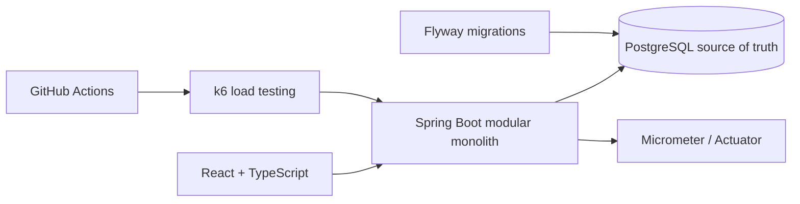

# TicketForge

[English README](README.en.md)

TicketForge 是一个高并发票务系统实验项目，用于演示原子库存预占、幂等下单、支付回调、超时取消、并发正确性和可观测性。

它不是一个真实商业票务平台，而是一个可以在 2 到 3 分钟内讲清楚核心交易链路的工程作品集项目。PostgreSQL 是库存和订单的最终事实来源；模拟支付仅用于本地开发演示；k6 数据是 CI 正确性测试或本地单机基线，不代表生产承载量。

## 核心功能

- 浏览演出和票档。
- 以 Demo User 预占库存并创建 `PENDING_PAYMENT` 订单。
- 支持用户级幂等下单。
- 支持取消订单、超时释放库存。
- 创建本地模拟支付 session。
- 模拟支付成功或失败。
- 支付成功后将库存从 `reserved` 转为 `sold`。
- Demo Dashboard 展示库存、订单、支付和最近订单。
- Demo reset 安全删除演示订单和支付记录，恢复演示库存。
- k6 验证并发正确性、超卖保护、幂等重试和支付回调重放。
- Micrometer / Actuator 暴露健康检查、指标和 Prometheus scrape endpoint。

## 架构图



## 2 分钟 Demo 流程

1. 启动 demo：`.\scripts\start-demo.ps1`
2. 在 `Purchase Demo` 选择票档和数量。
3. 点击 `Reserve tickets`，观察 `available -> reserved`。
4. 创建 payment session。
5. 先模拟支付失败，确认订单仍是 `PENDING_PAYMENT` 且库存保持 reserved。
6. 再创建 payment session 并模拟支付成功，观察 `reserved -> sold`。
7. 切换到 `System Dashboard` 查看库存、订单、支付统计和最近订单。
8. 点击 `Reset demo data`，确认演示订单和支付记录被删除，库存恢复。
9. 切换到 `How It Works` 讲解事务、幂等、锁顺序和 k6 正确性验证。

## Quick Start

```powershell
git clone https://github.com/Chikachi00/TicketForge.git
cd TicketForge
.\scripts\start-demo.ps1
```

`start-demo.ps1` 不启动 Docker、Redis 或任何后台隐藏进程。它会检查 Java、Node、npm、PostgreSQL 端口和 8080/5173 占用情况，然后在独立 PowerShell 窗口启动 backend 与 frontend。

## 数据库初始化

本地默认数据库配置：

```text
URL: jdbc:postgresql://localhost:5432/ticketforge
User: ticketforge
Password: ticketforge_dev
```

如果使用 Docker 基础设施：

```powershell
docker compose up -d
```

Flyway migration 位于：

```text
backend/src/main/resources/db/migration/
```

不要手动修改已执行的 `V1` 到 `V4` migration。应用启动后 Flyway 会自动建表和加载演示数据。

## Demo Profile

Backend demo 启动方式：

```powershell
cd backend
.\mvnw.cmd spring-boot:run "-Dspring-boot.run.profiles=demo"
```

`application-demo.yml`：

```yaml
ticketforge:
  demo:
    enabled: true
    secret: ${TICKETFORGE_DEMO_SECRET:ticketforge-local-demo-secret}
```

Demo 管理 API 只在 `demo` profile 且非 `prod` 时存在，并要求：

```http
X-Demo-Secret: ticketforge-local-demo-secret
```

这个默认值只用于本地演示。生产环境不得用前端环境变量暴露管理 secret。

## API 链接

- `GET /api/events`
- `GET /api/events/{eventId}`
- `GET /api/events/slug/{slug}`
- `POST /api/orders`
- `GET /api/orders/me`
- `GET /api/orders/{orderNumber}`
- `POST /api/orders/{orderNumber}/cancel`
- `POST /api/payments/orders/{orderNumber}`
- `GET /api/payments/{paymentTransactionId}`
- `POST /api/payment-simulator/{paymentTransactionId}/success`
- `POST /api/payment-simulator/{paymentTransactionId}/failure`
- `GET /api/demo/profile`
- `GET /api/demo/dashboard`
- `POST /api/demo/reset`
- `GET /actuator/health`
- `GET /actuator/metrics`
- `GET /actuator/prometheus`

## 并发正确性结果

最新报告见 [docs/performance/correctness-ci.md](docs/performance/correctness-ci.md)。

当前本地 summary 显示 oversell spike：

```text
50 concurrent order attempts
20 tickets
20 successful reservations
30 expected OUT_OF_STOCK
0 oversell
0 inventory inconsistency
P95 around 329.27 ms in the recorded local summary
```

This is a small GitHub Actions correctness run, not a production capacity benchmark.

## 技术亮点

- PostgreSQL 条件更新实现原子库存预占。
- 用户与幂等键唯一约束防止重复下单。
- 订单、库存、支付回调在事务内保持一致。
- 支付回调按 provider event 做幂等重放保护。
- Dashboard 服务端计算库存守恒：`available + reserved + sold = total`。
- Demo reset 只影响 `ticketforge-opening-live` 演示演出。
- k6 将预期 `OUT_OF_STOCK` 409 与真实异常区分统计。
- Micrometer 使用低基数业务 tag，避免订单号、邮箱和交易号进入 metrics tag。

## 项目结构

```text
backend/      Spring Boot modular monolith
frontend/     React + TypeScript + Vite demo UI
load-tests/   k6 scenarios and report scripts
docs/         architecture, demo walkthrough and correctness report
scripts/      local demo startup helpers
compose.yaml  PostgreSQL, Redis and Adminer for local infrastructure
```

## 测试命令

```powershell
cd backend
.\mvnw.cmd test
.\mvnw.cmd verify -Pintegration

cd ..\frontend
npm ci
npm run build

cd ..\load-tests
k6 inspect scenarios/smoke.js
k6 inspect scenarios/order-baseline.js
k6 inspect scenarios/oversell-spike.js
k6 inspect scenarios/idempotency-retry.js
k6 inspect scenarios/payment-callback-replay.js
k6 inspect scenarios/full-journey.js
.\scripts\generate-correctness-report.ps1
```

## 限制与 Roadmap

当前 Portfolio v1 已完成演示闭环。暂不实现 Redis、Redis Lua、分布式锁、虚拟排队、消息队列、JWT、真实支付、退款、WebSocket/SSE、微服务、Kubernetes、Prometheus Server、Grafana Server、选座、二维码票。

后续如果继续扩展，优先级应是：

1. 把 CI 集成测试迁移到稳定 Testcontainers。
2. 增加更完整的订单过期后台任务观测。
3. 在明确需求后再引入 Redis 队列或临时预占层。
4. 基于真实瓶颈再做性能优化，而不是提前微服务化。

## Git 提交规范

- `feat:` 新功能
- `fix:` 修复
- `perf:` 性能或压测相关
- `docs:` 文档
- `test:` 测试

TicketForge Portfolio v1 - Complete.
