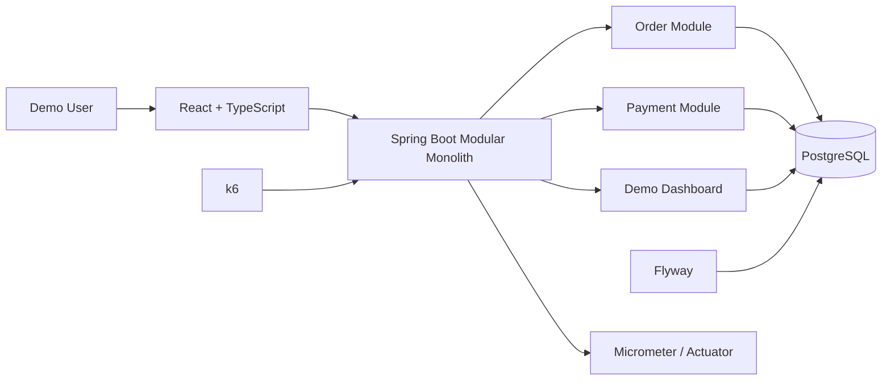
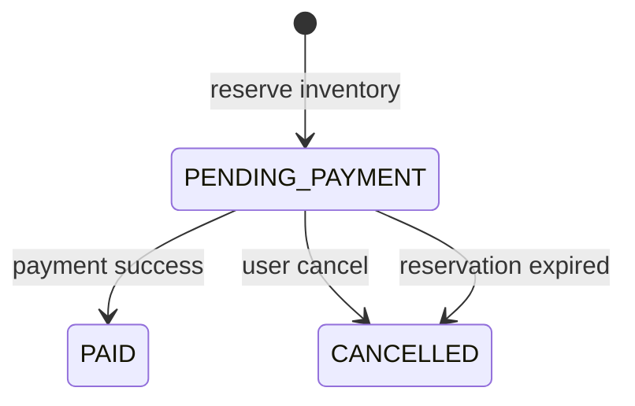

# TicketForge

> 完整中英双语 README 请见 [README.md](README.md)。本文件为中文单独版。

High-concurrency ticketing-system lab for atomic inventory reservation, idempotent ordering, simulated payment and concurrency correctness.

## 快速链接

- [GitHub](https://github.com/Chikachi00/TicketForge)
- [完整双语 README](README.md)
- [English README](README.en.md)
- [Demo Walkthrough](docs/demo-walkthrough.md)
- [System Design](docs/system-design.md)
- [Correctness Report](docs/performance/correctness-ci.md)
- [Architecture Notes](docs/architecture.md)

## 快速导航

- [项目简介](#项目简介)
- [核心功能](#核心功能)
- [技术栈](#技术栈)
- [架构与系统设计亮点](#架构与系统设计亮点)
- [订单与库存状态流转](#订单与库存状态流转)
- [并发正确性验证](#并发正确性验证)
- [本地运行](#本地运行)
- [Demo Profile](#demo-profile)
- [数据库](#数据库)
- [测试与验证](#测试与验证)
- [项目结构](#项目结构)
- [已知限制](#已知限制)
- [截图--demo](#截图--demo)
- [License](#license)

## 项目简介

TicketForge 是一个高并发票务系统实验项目，用于演示演出票务平台中的库存预占、幂等下单、支付回调、超时取消、并发竞争和可观测性。

它不是完整商业票务平台，而是一个后端工程和系统设计作品集项目。项目用 React 页面演示完整业务链路，用 Spring Boot 组织交易逻辑，用 PostgreSQL 作为库存、订单和支付状态的最终事实来源，用 k6 验证并发正确性。模拟支付只用于本地开发和演示。

TicketForge Portfolio v1 已完成，当前重点是展示一个可运行、可解释、可验证的核心交易闭环。

## 核心功能

### 购票演示

- 浏览演出和票档。
- 选择票档和数量。
- 创建 `PENDING_PAYMENT` 订单。
- 展示订单号、金额、状态和支付倒计时。
- 查询当前 Demo User 的订单。
- 主动取消待支付订单。

### 库存预占与防超卖

- 使用 PostgreSQL 条件更新实现原子库存预占。
- 只有 `available_stock >= quantity` 时才允许扣减。
- 库存状态分为 `available`、`reserved` 和 `sold`。
- 每个票档都必须满足库存守恒关系：

```text
available + reserved + sold = total
```

前端只展示服务端返回的数据，不把浏览器状态作为库存真相。

### 幂等下单

- 使用用户和 `Idempotency-Key` 的组合约束防止重复下单。
- 网络重试或重复点击会返回同一个订单。
- 重复请求不会重复预占库存。

### 订单取消与超时

- 支持主动取消待支付订单。
- 定时任务扫描过期订单。
- 取消和超时都会执行：

```text
reserved -> available
```

- 使用订单行锁避免重复释放库存。

### 模拟支付

- 创建本地模拟支付 session。
- 支持模拟支付成功和失败。
- 支付失败后，订单继续保持待支付，库存保持 `reserved`。
- 支付成功后：

```text
reserved -> sold
PENDING_PAYMENT -> PAID
```

- 支付回调使用 HMAC-SHA256。
- provider event 支持幂等重放。
- 支付、取消和超时共享一致的锁顺序。

### Demo Dashboard

- 后端健康状态。
- Demo profile 状态。
- 总库存、可售、预占、已售。
- 订单状态统计。
- 支付状态统计。
- 最近 10 个订单。
- 各票档库存。
- 服务端库存一致性检查。

### Demo Reset

- 只重置 `ticketforge-opening-live`。
- 删除该演出的订单和支付记录。
- 恢复该演出的库存。
- 不删除用户。
- 不影响 loadtest 演出。
- 不重置数据库 sequence。
- 不修改 Flyway history。

### 可观测性与压力测试

- Spring Boot Actuator。
- Micrometer Prometheus registry。
- 低基数业务指标。
- k6 smoke、baseline、oversell、idempotency、callback replay 和 full journey 场景。
- GitHub Actions 手动 Performance workflow。

## 技术栈

### Backend

- Java 21
- Spring Boot
- Spring Data JPA
- Spring JDBC
- PostgreSQL
- Flyway
- Maven
- Micrometer
- Spring Boot Actuator

### Frontend

- React
- TypeScript
- Vite
- Responsive CSS

### Testing and Tooling

- JUnit 5
- Mockito
- AssertJ
- Maven Surefire / Failsafe
- k6
- GitHub Actions
- PowerShell automation scripts

Redis currently exists only as optional local infrastructure and is not part of the Portfolio v1 transaction path.

## 架构与系统设计亮点



- 当前是模块化单体，而不是微服务。
- PostgreSQL 是库存、订单和支付状态的 source of truth。
- Controller 不直接操作 SQL。
- 事务逻辑位于 application service。
- Demo API 仅在 `demo` profile 下存在。
- load-test API 仅在 `loadtest` profile 下存在。
- `prod` 不暴露 Demo Reset。
- Flyway 管理 schema migration。

更完整设计见 [docs/system-design.md](docs/system-design.md)。

## 订单与库存状态流转

### 预占

```text
available - quantity
reserved  + quantity
order     -> PENDING_PAYMENT
```

### 支付成功

```text
reserved - quantity
sold     + quantity
order    -> PAID
payment  -> SUCCESS
```

### 取消或超时

```text
reserved  - quantity
available + quantity
order     -> CANCELLED
```



## 并发正确性验证

当前已确认的 oversell spike 结果来自现有 correctness summary：

```text
50 个并发下单请求
20 张库存
20 个订单成功预占
30 个请求正常返回 OUT_OF_STOCK
0 超卖
0 库存不一致
该次小规模测试 P95 约 329.27 ms
```

这是 GitHub Actions 或本地环境中的小规模并发正确性测试，用于验证状态一致性，不代表真实部署容量或正式 SLO。

完整结果见 [docs/performance/correctness-ci.md](docs/performance/correctness-ci.md)。

## 本地运行

最简单的启动方式：

```powershell
git clone https://github.com/Chikachi00/TicketForge.git
cd TicketForge
.\scripts\start-demo.ps1
```

脚本会：

- 检查 Java 21。
- 检查 Node 和 npm。
- 检查 PostgreSQL。
- 检查 8080 / 5173 端口。
- 启动 demo backend。
- 启动 Vite frontend。
- 等待 health check。
- 打开 `http://localhost:5173`。

说明：

- 不强制使用 Docker。
- 不自动结束已有 Java 或 Node 进程。
- 不自动启动 Redis。
- 日志保留在独立 PowerShell 窗口中。

手动启动 backend：

```powershell
cd backend
.\mvnw.cmd spring-boot:run "-Dspring-boot.run.profiles=demo"
```

另一个终端启动 frontend：

```powershell
cd frontend
npm install
npm run dev
```

## Demo Profile

```powershell
cd backend
.\mvnw.cmd spring-boot:run "-Dspring-boot.run.profiles=demo"
```

Demo API：

```text
GET  /api/demo/profile
GET  /api/demo/dashboard
POST /api/demo/reset
```

说明：

- Demo 管理 API 只在 `demo` profile 下存在。
- Reset 需要 `X-Demo-Secret`。
- 默认 secret 只用于本地。
- 不应把生产管理 secret 放入公开前端环境变量。

## 数据库

本地默认配置：

```text
Database: ticketforge
Username: ticketforge
Password: ticketforge_dev
Port: 5432
```

说明：

- PostgreSQL 需要提前安装和运行。
- Flyway 启动时自动执行 V1 到 V4。
- 不要修改已经执行的 migration。
- Docker Compose 是可选方案，不是必需方案。

可选 Docker 基础设施：

```powershell
docker compose up -d
```

Docker is optional. TicketForge can run with a locally installed PostgreSQL instance.

## 测试与验证

### Backend unit tests

```powershell
cd backend
.\mvnw.cmd test
```

### PostgreSQL integration tests

```powershell
.\mvnw.cmd verify -Pintegration
```

### Frontend

```powershell
cd frontend
npm ci
npm run build
```

### k6 static validation

```powershell
cd load-tests
k6 inspect scenarios/smoke.js
k6 inspect scenarios/order-baseline.js
k6 inspect scenarios/oversell-spike.js
k6 inspect scenarios/idempotency-retry.js
k6 inspect scenarios/payment-callback-replay.js
k6 inspect scenarios/full-journey.js
```

### Demo

```powershell
.\scripts\start-demo.ps1
```

## 项目结构

```text
TicketForge/
├─ backend/        Spring Boot backend
├─ frontend/       React + TypeScript demo UI
├─ load-tests/     k6 scenarios and reports
├─ scripts/        PowerShell startup scripts
├─ docs/           system design and demo documentation
├─ compose.yaml    optional local infrastructure
├─ README.md       bilingual main README
├─ README.zh-CN.md Chinese README
└─ README.en.md    English README
```

## 已知限制

- 只使用 Demo User，不包含正式认证系统。
- 支付为本地模拟。
- 不包含真实退款。
- 不包含真实出票、二维码或验票。
- 不包含选座。
- 不包含虚拟排队。
- Redis 暂未进入核心交易链路。
- 不包含消息队列。
- 当前是模块化单体，不是微服务。
- correctness 结果不代表真实部署容量。
- 没有公开线上部署时，只支持本地运行。

这些限制是 Portfolio v1 的范围控制，而不是商业票务平台的完整能力声明。

## 截图 / Demo

截图待补充。

## License

MIT License
