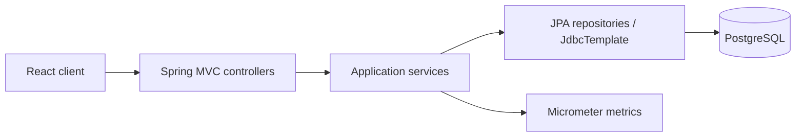
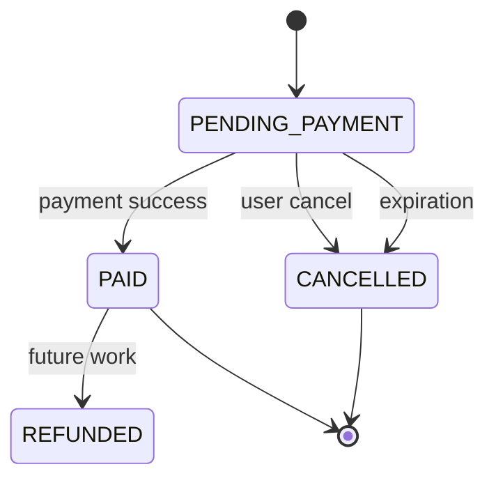
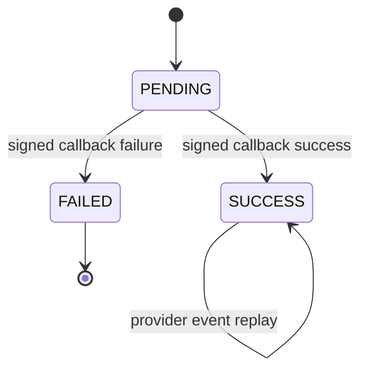
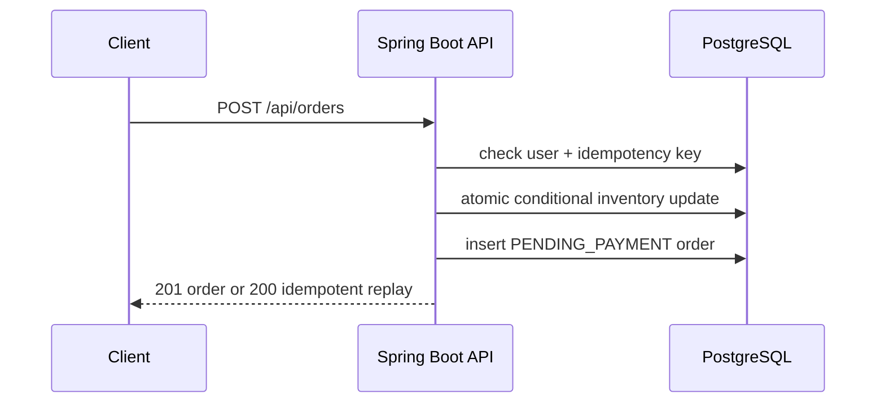
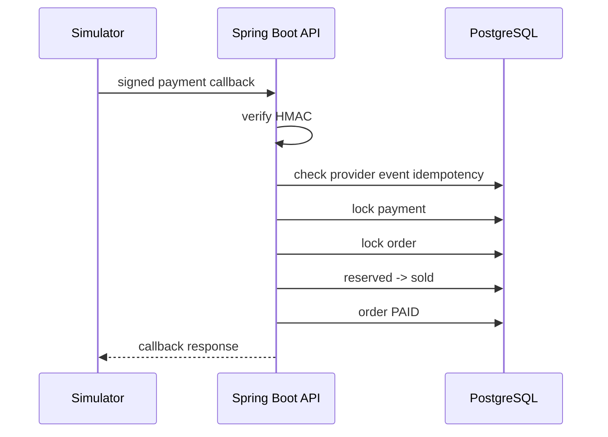

# TicketForge System Design

TicketForge is a modular monolith. It keeps one deployable Spring Boot backend while organizing code by business capability: event, inventory, order, payment, demo and loadtest.

## Architecture



PostgreSQL is the source of truth for inventory, orders and payment state. Redis is intentionally not part of Portfolio v1 because the current goal is to prove correctness with database transactions before adding temporary reservation or queueing layers.

## Order State Machine



## Payment State Machine



## Reservation Sequence



The inventory update is conditional: it only succeeds when available stock is enough. This prevents overselling under concurrent order attempts.

## Payment Callback Sequence



## Inventory Invariant

For every ticket tier:

```text
available + reserved + sold = total
```

The demo dashboard calculates this on the server. The frontend only displays server results.

## Idempotency Design

Order creation uses a user-scoped idempotency key. A repeated request with the same key returns the same order instead of reserving stock again.

Payment callbacks use provider event idempotency. A replayed provider event returns an idempotent response without processing the payment transition again.

## Lock Ordering

The payment path locks payment and order records before moving inventory. Cancellation and expiration lock the order before releasing reserved stock. The implementation avoids using Java `synchronized` for database concurrency.

## Why Not Redis Yet

Redis is useful for virtual queues, temporary pre-reservation and idempotency acceleration, but it adds another consistency boundary. Portfolio v1 keeps PostgreSQL as the only source of truth to make correctness inspectable and testable.
